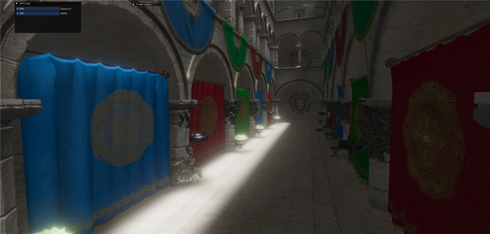

# Loft

Personal 3D rendering techniques playground.



## Motivation

Toy renderer using Vulkan and it's full capabilities.

## Modules

### Base

Mostly some common classes across modules. You won't go far without this one.

### FrameGraph

Frame graph implementation inspired by a nice talk by EA, about their implementation of FrameGraph in FrostBite.

### Window

Very basic implementation of windowing system. Will be improved in the future.

## Building

Building is done using CMake.

### Windows

You need to have installed:
- CMake: Either as part of Visual Studio or https://cmake.org/download/
- Vulkan: Use LunarG SDK package here https://sdk.lunarg.com/sdk/download/latest/windows/vulkan-sdk.exe (I recommend download the latest version now, there was a mistake recently, causing this project to not work)
    - NOTE: Make sure that you have SDL2 selected in Components
    - After installation, make sure you have environment variable VULKAN_SDK set to the path with Vulkan installed.

Then you can build with cmake:

In developer console, go to project directory and use:

```bash
$ cmake -S . -B build/
$ cmake --build build/
```

It will build the project into `build/` directory.

If you have built everything into `./build/` directory, use

```bash
$ ./build/examples/viewer/loft_viewer ~/path/to/some/file.gltf
```

I recommend this public repository to try out some glTF models:
https://github.com/KhronosGroup/glTF-Sample-Assets

Tested assets are:
- Sponza
- SciFi Helmet
